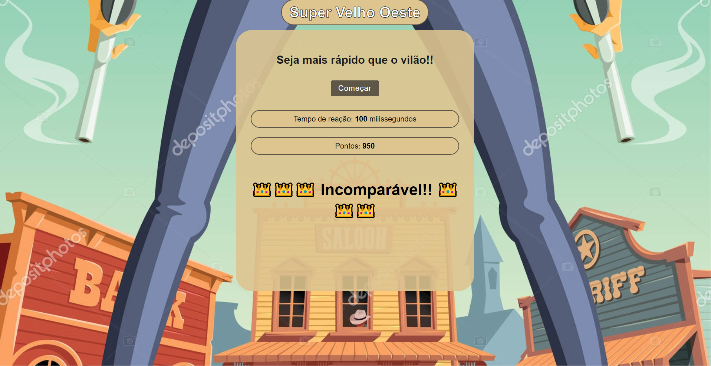
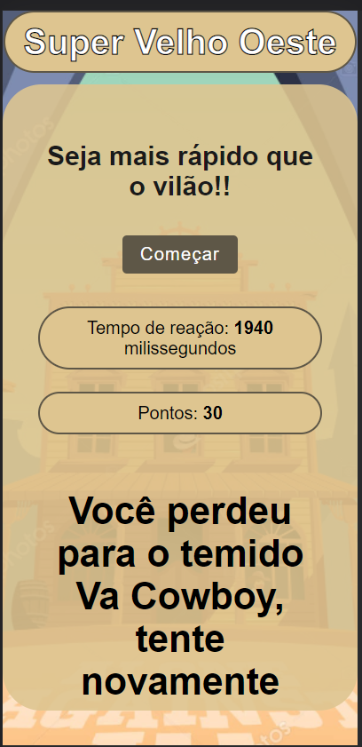

# Super Velho Oeste

## Conteúdo

- [Projeto](#projeto)
  - [Desafio](#desafio)
  - [Screenshot](#screenshot)
  - [Links](#links)
- [Processo de Criação](#processo-de-criação)
  - [Construído com](#construído-com)
  - [Aprendizado](#aprendizado)
- [Autor](#autor)

## Projeto

Neste projeto você irá enfrentar o perigoso Va Cowboy, seja o(a) mais rápido num duelo e saia vitorioso(a)!

### Desafio

O maior desafio desse projeto foi realizá-lo com o framework [Vue.js](https://vuejs.org/). Anteriormente, meus projetos foram feitos somente com o [React.js](https://reactjs.org/) e HTML, CSS e Javascript puro.

### Screenshot

 
    
   
    

### Links

- URL para o Site: [Super Velho Oeste](https://vue-super-velho-oeste.vercel.app/)

## Processo de Criação

### Construído com

- HTML Semântico
- CSS Customizado
- Flexbox
- Modais
- Mobile-first
- [Vue.js](https://vuejs.org/)

### Aprendizado

O aprendizado para este projeto foi enorme. O framework é bem parecido com o React.js, entretanto, a forma como ele usa props, importa e utiliza componentes e o layout do código foi bastante diferente e exigiu um bom tempo quebrando a cabeça e resolvendo alguns bugs.
Ao usar o Vue.js, eu também acho que pude melhorar meu entendimento de React.js, pois compreendi o uso de algumas funcionalidades do Vue que podem ser também aplicadas ao React de forma parecida e isso expandiu minha visão sobre ambos os frameworks.

## Autor

<table>
  <tr>
    <td align="center">
      <a href="https://www.linkedin.com/in/rafael99ldm/">
         
        
          <b>Rafael Lima</b>
        
      </a>
    </td>
  </tr>
</table>
